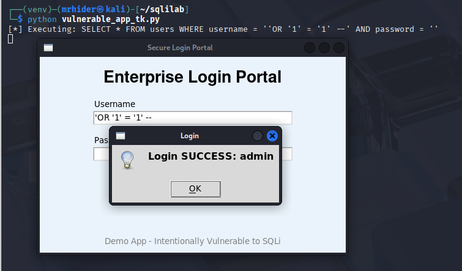
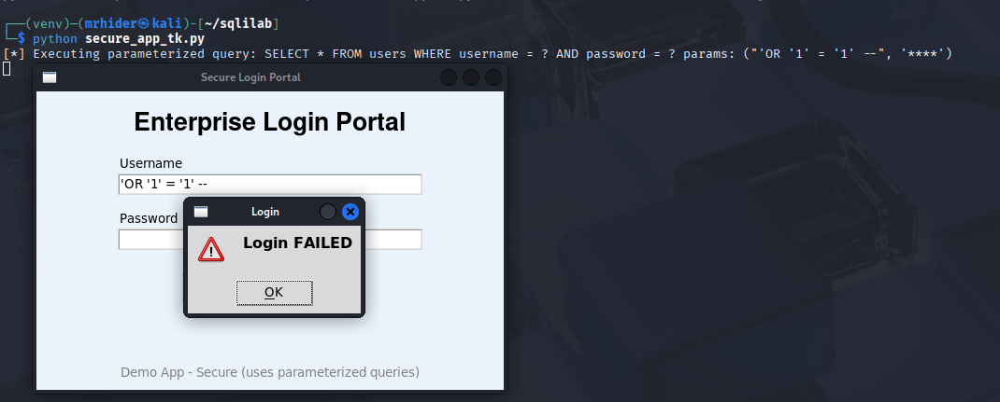

# 🧠 SQLi-Tk-Lab — Local SQL Injection Learning Lab

**Author:** Sunny Mishra (GitHub: https://github.com/sunnymishra565)  

---

## 🔎 Summary
This is a **local, offline learning lab** that demonstrates SQL Injection (SQLi) using a simple Python + Tkinter desktop login app. The repo contains an intentionally **vulnerable** app and a **secure** fixed version, plus instructions to reproduce and test safely on your local machine.

> ⚠️ **Important:** This project is for educational purposes only. Do **NOT** use these techniques on systems you do not own or have explicit written permission to test.

---

## 📁 Repository contents
- `vulnerable_app_tk.py` — intentionally vulnerable Tkinter login (string-concatenation SQL).  
- `secure_app_tk.py` — fixed version using parameterized queries.  
- `init_db.py` — creates `users.db` (local SQLite) with demo users.  
- `demo/` — screenshots / GIFs (optional) for visual demo.  
- `.gitignore` — excludes local DB, venv and caches.  
- `SECURITY.md` — responsible use guidance.  
- `CONTRIBUTING.md` — contribution guidelines.

---

## 🧪 Quick start (no terminal complexity — local & simple)
1. Clone or download the repo from GitHub and open the folder in your file manager or code editor.

2. (Optional) Create a Python virtual environment:
```bash
python3 -m venv venv
source venv/bin/activate
pip install bcrypt

3. Initialize the demo database (runs locally and creates users.db):
python init_db.py

4. Run the vulnerable GUI app:
python vulnerable_app_tk.py

5. Run the secure GUI app (to compare behavior):
python secure_app_tk.py

🔬 Demo / What to test (lab-only)

Open the GUI and try these payloads (only on your local lab):

Bypass password (comment)
Username: admin' --
Password: anything
→ In the vulnerable app this will likely bypass the password check.

Always-true payload
Username: ' OR '1'='1
Password: ' OR '1'='1
→ Makes the WHERE condition always true — demonstrates how SQLi works.

Watch the terminal where you launched the app — the vulnerable app prints the executed SQL:

[*] Executing: SELECT * FROM users WHERE username = '...' AND password = '...'

This helps you see how input changes the SQL query.

🛠 Why the vulnerable code is insecure (short)

The vulnerable code builds SQL by concatenating raw user input:

query = f"SELECT * FROM users WHERE username = '{uname}' AND password = '{pwd}'"
cur.execute(query)

An attacker can inject SQL syntax into uname or pwd to change query logic (bypass auth / read or modify data).

Fix / secure approach

Use parameterized queries so user input is treated as data:

query = "SELECT * FROM users WHERE username = ? AND password = ?"
cur.execute(query, (uname, pwd))

Other recommendations:

Hash passwords with bcrypt — never store plaintext passwords in production.

Use least-privilege DB accounts.

Do not show raw SQL errors to end users.

Add logging and monitoring for suspicious activity.

Demo images




